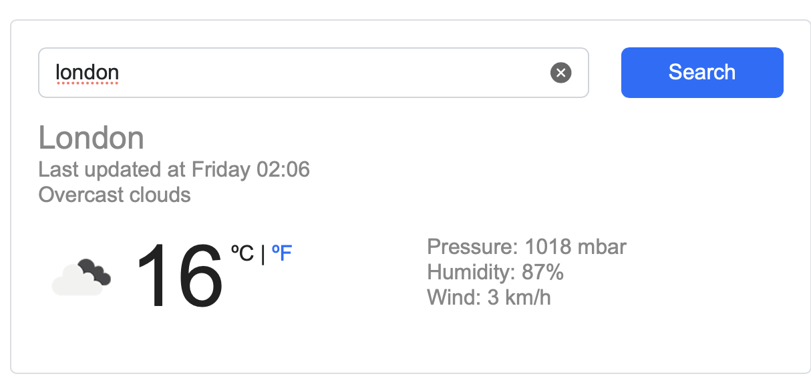

# Weather Application

A web-based weather application built with HTML, CSS, and JavaScript. The application allows users to search for cities worldwide and view current weather conditions, forecasts, and additional weather information using data from the OpenWeather API.

## Features

- Search weather information by city
- Real-time weather data
- 6-day weather forecast
- Temperature unit conversion (Celsius and Fahrenheit)
- Weather condition icons
- Wind speed, humidity, and pressure information
- Responsive user interface

## Technologies

- HTML5
- CSS3
- JavaScript (ES6)
- Bootstrap 5
- Axios
- OpenWeather API

## Project Structure

```text
Vanilla-weather-app/
│
├── index.html
├── weather.png
├── README.md
│
└── src/
    ├── app.js
    └── style.css
```

## Installation and Setup

### Clone the Repository

```bash
git clone https://github.com/Salmah1/Vanilla-weather-app.git
cd Vanilla-weather-app
```

### Run the Application

Open `index.html` in your web browser.

## How to Use

1. Enter a city name in the search box.
2. Click **Search**.
3. View the current weather conditions.
4. Check the multi-day forecast.
5. Switch between Celsius and Fahrenheit using the temperature controls.

## APIs

This project uses:

### OpenWeather API

https://openweathermap.org/api

## Screenshot


